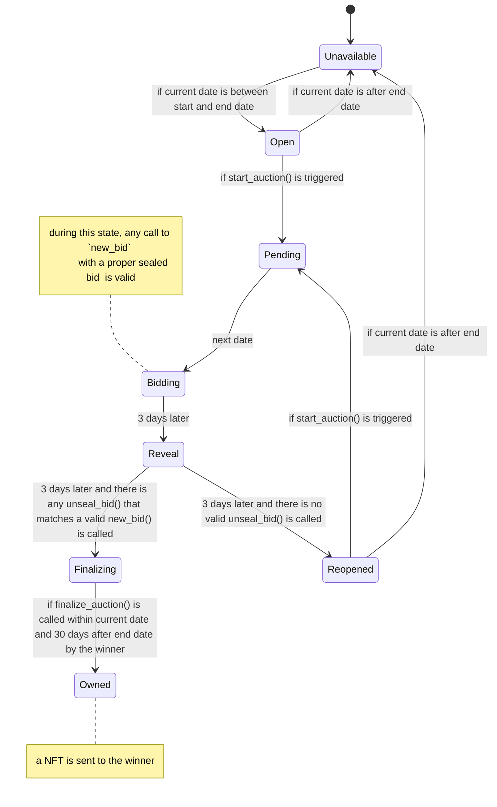
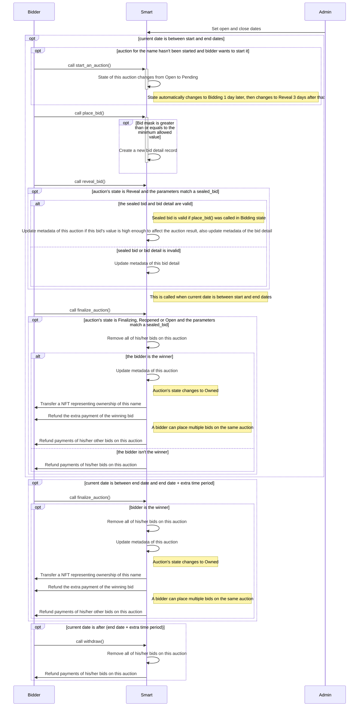

#### All possible scenarios of an auction for a domain name:

- No bids are submitted: The auction ends without a winner and the domain name remains unsold. This auction can be started again.
- There are bids that were submitted, but none of them is valid: The auction ends without a winner and the item remains unsold. This auction can be started again.
- Only one valid bid is submitted: The bidder who submitted the bid wins the auction and pays his/her actual bid amount.
- Multiple valid bids are submitted, and only one bidder has his/her bid amount equal to the highest value: The bidder who submitted the highest valid bid wins the auction and 
  pays the second-highest bid amount.
- Multiple valid bids are submitted, but some of them have their bid amount equal to the highest value: The bidder who submitted the first valid bid wins the auction 
  and pays the second-highest bid amount.
- Multiple valid bids are submitted, but some of them have their bid amount equal to the highest value and their bids made in the same epoch: The bidder who revealed the first valid bid wins the auction and pays the second-highest bid amount.

#### State diagram of an auction for a domain name
##### The following diagram shows the behaviour of an auction when being auctioned

#### Sequence diagram for interaction of the whole system
##### This diagram shows all the interaction between `Bidder`, `Smart contract` and `Admin`
Note: The admin needs to set `open` and `close` dates at the very start of the contract deployment.
If these values are not set, the attackers can register these domains via Controller.

