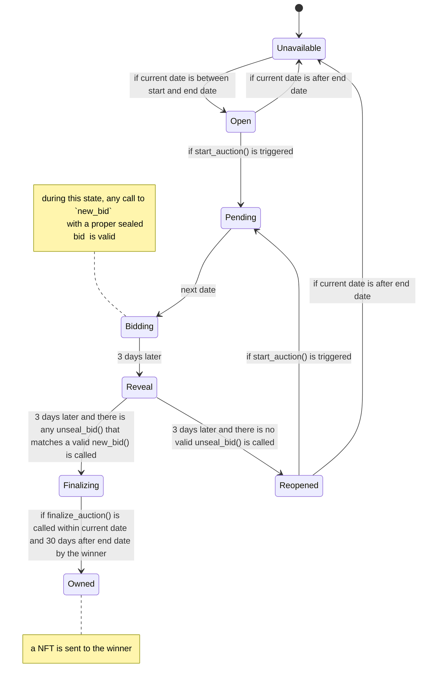

#### State diagram for an auction of a domain name

```mermaid
stateDiagram-v2
  [*] --> Unavailable
  Unavailable --> Open : if current date is between start and end date
  Open --> Unavailable : if current date is after end date
  Open --> Pending : if start_auction() is triggered
  Pending --> Bidding : next date
  note left of Bidding  
	  during this state, any call to `new_bid` 
	  with a proper sealed bid  is valid
  end note
  Bidding --> Reveal : 3 days later
  Reveal --> Finalizing : 3 days later and there is any unseal_bid() that matches a valid new_bid() is called
  Reveal --> Reopened : 3 days later and there is no valid unseal_bid() is called
  Reopened --> Pending : if start_auction() is triggered
  Reopened --> Unavailable : if current date is after end date
  Finalizing --> Owned : if finalize_auction() is called within current date and 30 days after end date by the winner
  note right of Owned  
	  a NFT is sent to the winner
  end note
```

#### Sequence diagram for interaction of the whole system
