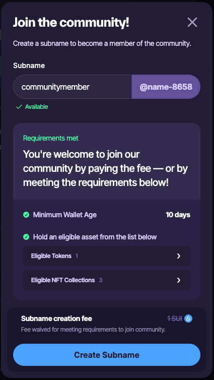

SuiNS Communities is a social identity layer on Sui. You can join ecosystem-specific communities by claiming subnames to unlock access to community-specific features, analytics, and subname distribution mechanics. Each community owns a dynamic community page, with real-time stats, token and NFT insights, as well as social layer tooling.

The SuiNS Communities home page displays community-wide data, analytics, and social update widgets:

- **Community Showcase:** Displays the avatars for the top projects as voted on by the SuiNS community.
- **Community Growth:** Displays a hyperlinked, ordered list of the top communities based on number of subnames.
- **Top Communities:** Displays a bubble chart of top communities. A larger circle equals more subnames.
- **Trending Community updates:** Displays related social feed activity across SuiNS Communities.
- Additional widgets provide overviews on community status, health, and activity.

## Community pages

The entry point to every community is through a dedicated landing page. This is where SuiNS Communities gathers community information and social feeds of community interest.

**TODO: Is there a search that I'm missing?**

## WHO requirements {#who}

Community creators and administrators can define what on-chain assets you must own before you can join their community. The community minter sets these requirements, but the community administrator can update them at any time. 

The requirements can include:

- Owning a specific token, potentially more than a certain amount.
- Owning an NFT from a specific collection.
- The connected wallet being older than a set threshold (ex., 10 days).

Asset ownership is verified on-chain, and potential members only need one qualifying asset.

If a wallet-age threshold is configured, membership requires both:

- One qualifying asset.
- A wallet age that meets or exceeds the threshold.   

## FEE requirements {#fee}

Community creators and administrators have the option to allow potential members to join their community through digital payment. This option allows users that do not meet the WHO requirements to still join. The fee amount is set by each community administrator and therefore not controlled by SuiNS Communities. Most of the fees (90%) go to the address that owns the community, with the rest paid as a fee to SuiNS Communities.   

## Join a community

To join a community, you need to meet the [WHO requirements](#who) or pay the [FEE requirement](#fee) (if available). When you join, you mint a subname to the community. Your name takes the form `{member_name}@{community_name}`.

To join:

1. Select the **Connect Wallet** button.
1. Select the community avatar from the SuiNS Communities home page to open its dedicated page.
1. Select the **Join Community** button.
1. A dialog opens for you to create your subname. Type your desired name in the **Subname** field. If the name is already claimed in the community, you must use a different one.
1. If your connected account satisfies the WHO requirements or you agree to pay the FEE requirements, select **Create Subname**.
1. Approve the transaction from your wallet to pay for gas and possible FEE requirement.
1. If successful, the dialog closes and you should now see your avatar in the **Community Members** section.

## Create and edit a community

:::info

You must have a [SuiNS name](https://suins.io) set as the default for the connected wallet address.

:::

Whether you are creating a community or editing an existing one, you use the same form. 

Select the **Connect Wallet** button and connect the wallet you want to use to mint the community. Complete each section of the form. 

**TODO: How to get here. Am I missing an admin panel?**

### Appearance 

Your community homepage includes an avatar and background. To update, select the file upload dropzone or drag and drop the desired file into the relevant area.

The **Avatar** is used to visually represent your community in various widgets across SuiNS Communities.

The **Cover Photo** is used as the hero banner for the community page.

### Description

The **Sui Name** field value is added automatically using the default SuiNS name for the connected wallet. If you don't see a name, check that you have the correct wallet connected and that the SuiNS name is set as the default for the address.  

Include a description for your community. The description is important to help potential members understand the community vision. 

**Community Intro** provides an initial overview of your community. The introduction is short but should be descriptive enough to entice potential members to learn more.

**Community Description** provides a more detailed description of the community. The description informs potential members about the community so that they can decide if the community's interests align with their own.

Both fields are limited to a finite number of characters. It's more effective and makes better use of the limited space if you do not repeat the introduction in the description. The goal is to provide an overview of the community so those interested can make an informed decision if they want to join.

### Engage

Update the URLs that are relevant to your community. Including social feeds helps members stay up to date with relevant news.

The relevant links for the completed fields appear as icon links on your community page. They are also used to generate updates from those sources in your community widgets.

:::info

The only required field is a community X feed.

:::

You can also add **Top X Followers** to include links to their X profile and update feed widgets with their posts.

### Enable subname faucet

Decide if you want to enable the community's subname faucet. The subname faucet allows joining members to mint a subname that is attached to the community. If allowed, members create a name when joining the community. The name appears in the form `{member_name}@{community_name}`. 

There is a one-time fee for turning this feature on. If you decide to enable it, switch the toggle. When enabled, the toggle turns green and the **Acceptance Criteria** section appears. Use the relevant fields to require certain assets that a potential member must possess to join the community. You can use the buttons under each field to add additional requirements of that type. If the wallet owns any one of the required assets, then it meets the [WHO requirement](#who).

If you want to charge a fee to create a subname, enable the **Fee for Subname Creation** toggle. The address to receive the proceeds is automatically set to the owner's address and cannot be changed. Set the fee amount in the final field.

### Finalize community creation

Review the information you set. When satisfied, select the **Create Community** button.

You can always update the community settings after creation. If you disable the subname faucet later, the setup fee is not refunded.
