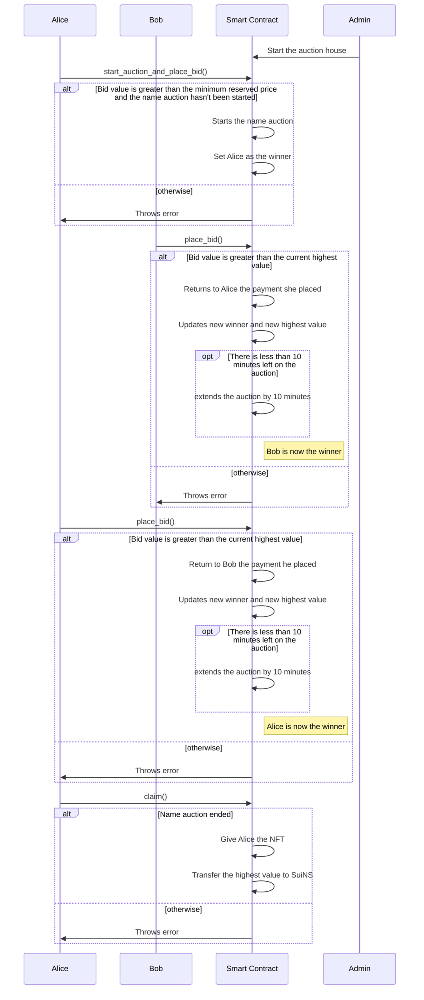

#### All possible scenarios that can occur in a live auction for domain name::

- No Bids Placed: The auction ends without any bids, and the name remains unregistered.
- Minimum Reserve Price Not Met: Bids were placed, but none of them reached the minimum reserve price. The auction ends without a winner, and the name remains unregistered.
- Winning Bid Meets Reserve Price: A bid is placed that meets or exceeds the reserve price. The auction ends, and the bidder with the highest bid wins the domain name.
- Multiple Bidders with Increasing Bids: Multiple users place bids on a name, with each bid being higher than the previous one. The auction continues until the bidding period ends, and the bidder with the highest bid wins.
- Same Bid Amounts: Two or more bidders place the same bid amount. As per the rules, each new bid must be greater than the previous highest bid. In this case, the system would reject the duplicate bid and prompt the bidder to place a higher bid.
- Last-Minute Bid: A bid is placed within 5 minutes before the auction's scheduled end time. The auction end time is extended by 10 minutes to allow other bidders to place higher bids. This process repeats until no bids are placed within the last 10 minutes.

#### Sequence diagram for interaction of the whole system
##### This diagram shows all the interaction between `Bidders`, `Smart Contract` and `Admin`

